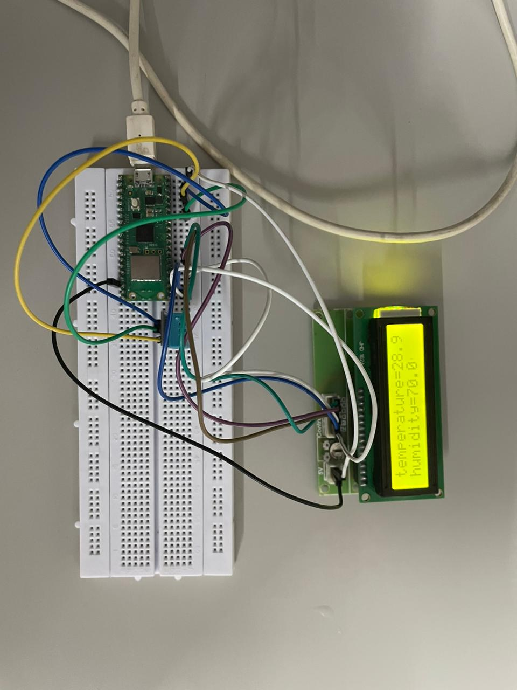

# Table of Contents

  -   [Temperature-and-Humidity-Detection-and-Prediction-Using-Raspberry-Pi-Pico-W-and-Machine-Learning](#Temperature-and-Humidity-Detection-and-Prediction-Using-Raspberry-Pi-Pico-W-and-Machine-Learning)
  - [Project Overview](#project-overview)
  - [Project Inspiration](#project-inspiration)
  - [Required Hardware](#required-hardware)
  - [Required Software](#required-software)
  - [Installation and Setup](#installation-and-setup)
  - [Running and Debugging](#running-and-debugging)
  - [Raspberry Pi Pico Pin Diagram](#Raspberry-Pi-Pico-Pin-Diagram)
  - [Wiring](#wiring)
  - [Wrapping It Up](#wrapping-it-up)

# Creating a Temperature-and-Humidity-Detection-and-Prediction-Using-Raspberry-Pi-Pico-W-and-Machine-Learning

## Project Overview

In this project, the goal is to create a system that leverages a Raspberry Pi Pico-W to implement a machine learning model. This model is designed to analyse data related to temperature and humidity that are captured by DHT-11 temperature sensor . The result will be displayed on a  LCD screen. The machine learning algorithm will then predict or forecast temperature and humidity levels based on the input data. The project aims to showcase the capabilities of the Raspberry Pi Pico-W in implementing machine learning applications for environmental monitoring.
The entire process, from data capturing of temperature and humidity to prediction, will be self-contained on the Raspberry Pi Pico-W board. 
[YouTube link](https://youtu.be/f9YPeSlX1Q8?si=42nX37JIC4Ccsiwo)

## Project Inspiration

This project drew inspiration from [Temperature-and-Humidity-Detection-and-Prediction using Raspberry Pi Pico-W and Machine Learning](https://www.instructables.com/DHT11-With-Raspberry-Pi-Pico/). While the core idea remains similar, several necessary changes and enhancements have been made to adapt it to our specific requirements and goals.

## Required Hardware

1. Raspberry Pi Pico-W: This project is designed for the Raspberry Pi Pico-W, but it may work on other boards that support CircuitPython with some modifications. Ensure your board has sufficient GPIO pins, as almost 80% of the Pi Pico's GPIOs are used.

2. JHD 162A LCD: You'll need a compatible LCD display. Other displays may work with code adjustments, but an LCD is essential for displaying the live temperature and humidity values accurately.

3. * DHT-11 Temperature and Humidity Sensor*: This sensor is used for getting temperature and humidity values . It's an affordable option for this project.

4. *Full-sized breadboard (highly recommended)*: A breadboard facilitates connections between components.

5. Jumper Cables: You'll need male-to-female (M-F) and male-to-male (M-M) jumper cables for making various connections.

## Required Software

1. Any text editor: You'll need a text editor for editing the code if necessary.

2. A full Python distribution and pip: These are required for training and exporting the machine learning model.

3. Patience: Building and fine-tuning this system may require some patience.

The project aims to display the classification results on the JHD 162A LCD, making it a practical and interactive solution. It leverages CircuitPython for its versatility, ensuring compatibility with various boards supporting CircuitPython.

## Installation and Setup

1. Install CircuitPython on Your Board: Start by installing CircuitPython on your Raspberry Pi Pico-W board.

2. Download Necessary Library Files: Visit the CircuitPython website to download the necessary library files. Alternatively, you can obtain these files from the website and paste them into the "lib" folder on your board.

3. Copy Code Files: Copy and paste the following files into your board:
   - wlan.py
   - printhelo.py
   - finaltemp.py
   - dht11.py

This step ensures that you have all the required files in place for running your project successfully.
## Running and Debugging

To run and debug your code, follow these steps:

1. Use an Integrated Development Environment (IDE), preferably Thonny IDE.

2. Ensure that your Raspberry Pi Pico is connected to your computer.

3. Refer to the connection details provided below for proper setup and debugging.

Please note that you'll need to configure your IDE to work with your Raspberry Pi Pico for effective code development and debugging.

## Raspberry Pi Pico Pin Diagram

## Wiring

For this project, a substantial amount of wiring is required. It is highly recommended to use breadboards and jumper cables for a clean and organized setup.

### LCD Connections

| LCD PIN NAME    | Pi Pico Pin Name                   |
|-----------------|------------------------------------|
| RS              | GP16                               |
| EN              | GP17                               |
| D4              | GP18                               |
| D5              | GP19                               |
| D6              | GP20                               |
| D7              | GP21                               |

### DHT11 CONNECTIONS
| DHT11 PIN NAME  | Pi Pico Pin Name                   |
|-----------------|------------------------------------|
| OUT             | GP28                               |

## Wrapping It Up

In this innovative project, we set out to transform our Raspberry Pi Pico into a versatile tool for Temperature and Humidity Detection, equipped with the capability to predict future temperature and humidity trends using Machine Learning. Our inspiration drew from the vast potential of combining microcontrollers, sensor technology, and advanced algorithms to create a comprehensive solution.

The cornerstone of our endeavor is the utilization of the DHT11 sensor, a reliable component chosen for its precision in measuring both temperature and humidity. This sensor serves as the linchpin for gathering real-time data, allowing our Raspberry Pi Pico to capture and process environmental conditions with accuracy.

The project involves meticulous wiring and the careful integration of software components to ensure seamless functionality. Additionally, we've employed machine learning algorithms to analyze historical data trends, enabling our system to make predictions about future temperature and humidity levels. This forward-looking capability adds a predictive dimension to the project, making it not only a monitoring tool but also a valuable resource for anticipating environmental changes.

Just like in any project, attention to detail is crucial, and we have paid special consideration to the selection of appropriate gear and the implementation of the necessary software elements. The convergence of hardware, software, and data analytics showcases the versatility and power of the Raspberry Pi Pico in creating a self-contained system for environmental monitoring and prediction.

As we conclude this project, we hope that it serves as a source of inspiration for others interested in exploring the intersection of microcontrollers, sensor technologies, and machine learning. With determination and curiosity, anyone can delve into the world of DIY electronics and develop their own unique applications. We look forward to seeing how others build upon and innovate within this exciting field.
